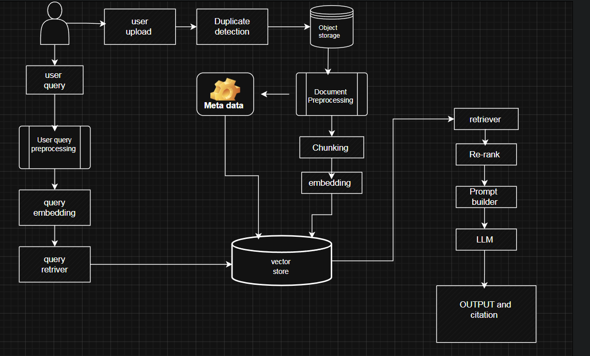

# Smallbook

SmallBook is a **Retrieval-Augmented Generation (RAG)** powered knowledge assistant that enables users to upload, index, and interact with their own documents through natural language conversations. The system supports multiple data sources, including text, OCR-processed documents, and video transcripts, transforming them into a searchable knowledge base using semantic embeddings and vector search.

The project is built around a modular RAG pipeline featuring **duplicate detection**, **document preprocessing**, **metadata extraction**, **semantic chunking**, **vector embeddings**, **retrieval system**, and **citation-backed response generation**. By grounding responses in retrieved context rather than relying solely on an LLM's internal knowledge, SmallBook delivers more accurate, transparent, and context-aware answers while minimising hallucinations.

## Features

- Upload and index text documents, scanned PDFs, and video transcripts
- Duplicate detection to avoid redundant indexing
- Automated document preprocessing and metadata extraction
- Semantic chunking and dense vector embeddings
- Fast semantic search using a Vector Database
- Cross-encoder reranking for improved retrieval quality
- Context-aware response generation using an LLM
- Citation-backed answers for improved transparency
- Modular architecture supporting easy component replacement and scalability

---

## System Architecture

